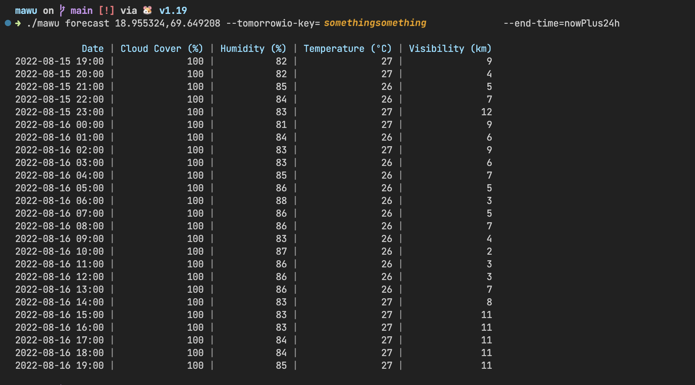

# mawu
Mighty Astronomical Weather Utility. A CLI tool written in Golang that uses Tomorrow.io to check when the weather is good for stargazing.



## Usage

This utility is a work in progress!
To get the forecast for a location, run the following:

```bash
go build
./mawu forecast <COORDINATES> --tomorrowio-key=<YOUR_TOMORROW_IO_API_KEY> --end-time=nowPlus24h
```

## TODOs
- Are there better ways to use Cobra and Viper?
- Where should the API key be stored? Setting it in the environment is annoying.
- Should a caching layer be added to avoid hitting the API too often (limit is 500r/m) ? Or should there be multiple weather data providers to loop through in case one hits the limit?
- Should I make a Rust (`mawu-rs`) version of this just for learning?
- Add validation for location coordinates
