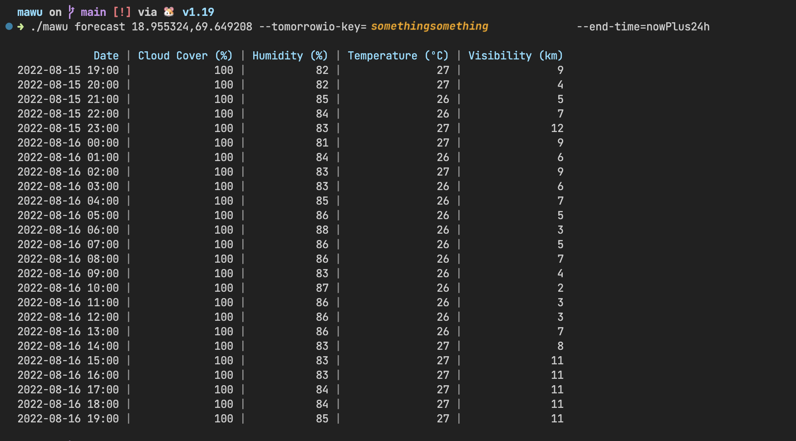

# mau
Mighty Astronomical Utility. A CLI tool written in Golang to retrieve information useful for astronomy.




## How to build

To build `mau`, run the following command:

```bash
go build
```

## Available commands

- `mau forecast`: Get the weather forecast relevant for astronomy for a set or coordinates. Example:

```bash
mau -k <YOUR_TOMORROW_IO_API_KEY> forecast 18.955324,69.649208

┌────────────────────────────────────────────────────────────────────────────────────────┐
|             Date | Cloud Cover (%) | Humidity (%) | Temperature (ºC) | Visibility (km) |
| 2022-08-19 19:00 |              59 |           85 |               27 |              11 |
| 2022-08-19 20:00 |              20 |           86 |               27 |              11 |
| 2022-08-19 21:00 |              35 |           86 |               27 |              10 |
| 2022-08-19 22:00 |              32 |           86 |               26 |              11 |
| 2022-08-19 23:00 |              25 |           87 |               26 |              10 |
| 2022-08-20 00:00 |              86 |           87 |               26 |              10 |
| 2022-08-20 01:00 |              98 |           86 |               27 |              11 |
| 2022-08-20 02:00 |              92 |           85 |               27 |              11 |
| 2022-08-20 03:00 |             100 |           85 |               27 |              11 |
| 2022-08-20 04:00 |             100 |           85 |               27 |              10 |
| 2022-08-20 05:00 |              98 |           84 |               27 |              10 |
| 2022-08-20 06:00 |              98 |           84 |               27 |              11 |
| 2022-08-20 07:00 |              99 |           84 |               27 |              12 |
| 2022-08-20 08:00 |              98 |           85 |               27 |              12 |
| 2022-08-20 09:00 |              41 |           85 |               27 |              11 |
| 2022-08-20 10:00 |              34 |           85 |               27 |              11 |
| 2022-08-20 11:00 |              53 |           85 |               27 |              11 |
| 2022-08-20 12:00 |              43 |           86 |               27 |              11 |
| 2022-08-20 13:00 |              49 |           85 |               27 |              11 |
| 2022-08-20 14:00 |              93 |           85 |               27 |              10 |
| 2022-08-20 15:00 |              99 |           85 |               27 |              11 |
| 2022-08-20 16:00 |             100 |           84 |               27 |              10 |
| 2022-08-20 17:00 |             100 |           85 |               27 |              11 |
| 2022-08-20 18:00 |             100 |           86 |               27 |              11 |
| 2022-08-20 19:00 |             100 |           86 |               27 |              11 |
└────────────────────────────────────────────────────────────────────────────────────────┘
```

- `mau locate`: Get the coordinates of a place. Example:

```bash
mau locate tromso

 SUCCESS  6 coordinate(s) found!
┌─────────────────────────────────────────────────────────────────────────────────────────────────────────────────────────────────────────────────────────┐
| Name                                                                                                      | Latitude  | Longitude | Latitude, Longitude |
| Tromsø, Troms og Finnmark, Norge                                                                          | 69.651648 | 18.955819 | 69.651648,18.955819 |
| Tromso, Wenchi Municipal District, Bono Region, Ghana                                                     | 7.558820  | -2.163072 | 7.558820,-2.163072  |
| Tromsö, Haparanda kommun, Norrbottens län, Sverige                                                        | 65.712138 | 23.761817 | 65.712138,23.761817 |
| Sentrum legekontor, Tromsø, Killengreens gate, Skarpsno, Nordbyen, Tromsø, Troms og Finnmark, 9008, Norge | 69.649739 | 18.959848 | 69.649739,18.959848 |
| Utleiecompagniet AS, Tromsø, Gimlevegen, Gimle, Tromsø, Troms og Finnmark, 9019, Norge                    | 69.684069 | 18.990678 | 69.684069,18.990678 |
| Harila, Tromsø, Skattørvegen, Skattøra, Tromsø, Troms og Finnmark, 9018, Norge                            | 69.696052 | 19.013815 | 69.696052,19.013815 |
└─────────────────────────────────────────────────────────────────────────────────────────────────────────────────────────────────────────────────────────┘
```

## TODOs
- Add forecast for a specific time, e.g. "tomorrow"
- Add more data layers to the forecast (precipitation, dew point, moonphase, bortle class, sun/no-sun)
- Add algorithm to generate hour quality-score based on weather data
- Add tests
- Investigate features of other tools

## Thoughts
- The `go-resty` package was a good choice for the HTTP client, it's easy to use and hides a lot of the boilerplate needed when making HTTP requests with Golang. We are now using the native `net/http` package instead for "purity".
